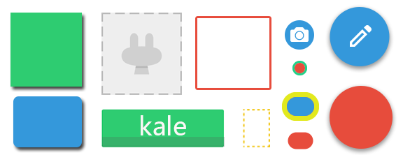

# SelectorInjection  

selector注入器。它可以给view注入一个selector状态，免去了你写selector的麻烦。  
--  

## 前言   
之前特别讨厌写selector，所以最近想要干掉它，借鉴了[https://github.com/hanks-zyh/SelectorButton](https://github.com/hanks-zyh/SelectorButton)和[https://github.com/navasmdc/MaterialDesignLibrary](https://github.com/navasmdc/MaterialDesignLibrary)两个开源库的写法，最终融汇贯通，产生了能将颜色和形状两两组合的selector注入器。现在这个注入器支持且**不仅仅**支持下列的按钮，你可以通过layer-list和shape的组合产生更多的按钮。  
 
 

## 使用方式 
我们可以根据需要将其注入到任何一个view中去，本项目中将其注入到了ImageButton和TextView中，下面是将其注入到ImageButton的过程。

**PS**:SelectorImageButton、SelectorTextView已经在lib库中写好，可以直接引用。  

首先，我们在values中定义一个attribute   
```xml  
<declare-styleable name="SelectorImageButton">
        <attr name="normal_color" />
        <attr name="pressed_color" />
        <attr name="stroke_color" />
        <attr name="stroke_width" />
        <attr name="normal_drawable" />
        <attr name="pressed_drawable" />
        <attr name="smart" />
    </declare-styleable>
```  
接着写一个view，并在初始化的时候new一个selectorInjection  

```java 
public class SelectorImageButton extends ImageButton {

    public SelectorImageButton(Context context) {
        super(context);
    }

    public SelectorImageButton(Context context, AttributeSet attrs, int defStyle) {
        super(context, attrs, defStyle);
    }

    public SelectorImageButton(Context context, AttributeSet attrs) {
        super(context, attrs);
        TypedArray array = context.obtainStyledAttributes(attrs, R.styleable.SelectorImageButton);
        SelectorInjection injection = new SelectorInjection(this, array);
        injection.injection();
        array.recycle();
    }


    @Override
    public void setEnabled(boolean enabled) {
        super.setEnabled(enabled);
        if (!enabled) {
            setAlpha(0.3f);
        }
    }
}

```  
最后，可以愉快的使用这个view了  
```xml
	<kale.injection.SelectorImageButton
        app:normal_drawable="@drawable/kale"
        app:pressed_drawable="@drawable/pressed_drawable"
        />  
```   

## 还有更多  
你以为它仅仅是干掉了selector么？当然不是，它还对shape有着巨牛逼的支持。我们定义一个shape，然后传入一个normalColor，它会自动将normalColor填充到shape中并且自动产生按下后的点击效果。而shape中我们可以做的事情就多了，比如添加个边框、加个虚线什么的。但shape仅仅能画的是简单且扁平化的形状，能不能让它支持阴影什么的呢？当然可以，SelectorInjection还支持了layer-list。你可以将阴影的框架和shape进行叠加，这样就能产生很多其他的效果了。至于具体的做法嘛，还是去看看源码吧。  
下面是全部的attribute和解释：  
 
```xml
    <!-- 底色 -->
    <attr name="normal_color" format="color" />
    <!-- 按下后的颜色 -->
    <attr name="pressed_color" format="color" />
    <!-- 边界描边的颜色 -->
    <attr name="stroke_color" format="color" />
    <!--外界描边的宽度 -->
    <attr name="stroke_width" format="dimension" />
    <!-- 常规状态下-->
    <attr name="normal_drawable" format="reference" />
    <!-- 按下/获得焦点 -->
    <attr name="pressed_drawable" format="reference" />
    <!-- 是否是自动计算的 -->
    <attr name="smart" format="boolean" />  
```

## 原理  
这个注入器就一个类文件，原理是将按钮的形状和颜色进行组合，产生多种样式的按钮，同时根据普通状态下的颜色进行了计算，自动生成了按下后的按钮颜色值。类源码如下：  
```java
package kale.injection;

import android.content.res.TypedArray;
import android.graphics.Color;
import android.graphics.drawable.Drawable;
import android.graphics.drawable.GradientDrawable;
import android.graphics.drawable.LayerDrawable;
import android.graphics.drawable.StateListDrawable;
import android.os.Build;
import android.view.View;

/**
 * view的一个selector注入装置，通过构造函数即可注入。之后调用injection()即可.
 * @author Jack Tony
 *        
 * @date 2015/5/25
 */
public class SelectorInjection {

    private static final int DEFAULT_COLOR = android.R.color.transparent;

    public static final int DEFAULT_STROKE_WIDTH = 2;

    private View mView;

    /**
     * 是否是智能模式，如果是的那么会自动计算按下后的颜色
     */
    boolean mIsSmart = true;

    /**
     * 正常情况颜色
     */
    private int mNormalColor;

    /**
     * 按下后的颜色（smart关闭后才有效）
     */
    private int mPressedColor;


    /**
     * 描边的颜色
     */
    private int mStrokeColor;

    /**
     * 描边的宽度，如果不设置会根据默认的宽度进行描边
     */
    private int mStrokeWidth;


    /**
     * 正常情况下的drawable
     */
    private Drawable mNormal;

    /**
     * 按下后的drawable
     */
    private Drawable mPressed;


    SelectorInjection(View view, Drawable normal, Drawable pressed, int normalColor, int pressedColor) {
        this(view, normal, pressed, normalColor, pressedColor, true);
    }

    SelectorInjection(View view, Drawable normal, Drawable pressed, int normalColor, int pressedColor, boolean isSmart) {
        this(view, normal, pressed, normalColor, pressedColor, isSmart, DEFAULT_COLOR, DEFAULT_STROKE_WIDTH);// 2是默认的描边宽度
    }

    SelectorInjection(View view, Drawable normal, Drawable pressed, int normalColor, int pressedColor, boolean isSmart,
            int strokeColor, int strokeWidth) {
        mView = view;
        mNormal = normal;
        mPressed = pressed;
        mNormalColor = normalColor;

        mPressedColor = pressedColor;
        mIsSmart = isSmart;
        mStrokeColor = strokeColor;
        mStrokeWidth = strokeWidth;

    }

    SelectorInjection(View view, TypedArray typedArray) {
        mView = view;
        mIsSmart = typedArray.getBoolean(R.styleable.SelectorImageButton_smart, true);
        mNormalColor = typedArray.getColor(R.styleable.SelectorImageButton_normal_color, DEFAULT_COLOR);
        mPressedColor = typedArray.getColor(R.styleable.SelectorImageButton_pressed_color, DEFAULT_COLOR);

        mStrokeColor = typedArray.getColor(R.styleable.SelectorImageButton_stroke_color, DEFAULT_COLOR);
        mStrokeWidth = typedArray.getDimensionPixelSize(R.styleable.SelectorImageButton_stroke_width, DEFAULT_STROKE_WIDTH);
        mNormal = typedArray.getDrawable(R.styleable.SelectorImageButton_normal_drawable);
        mPressed = typedArray.getDrawable(R.styleable.SelectorImageButton_pressed_drawable);
        // typedArray.recycle();
    }

    protected void injection() {
        StateListDrawable selector = new StateListDrawable();// 背景选择器
        // 是否启动智能模式
        if (mIsSmart && mNormal != null && mNormalColor != DEFAULT_COLOR) {
            mPressed = mNormal.getConstantState().newDrawable();
        }

        /**
         * 开始设置按下后的样式（颜色，描边）
         */
        if (mPressed instanceof GradientDrawable) {
            // 如果是shape
            setPressedColor(mIsSmart, (GradientDrawable) mPressed, mNormalColor, mPressedColor);
            setStroke((GradientDrawable) mPressed, mStrokeColor, mStrokeWidth);
        }
        Drawable pressedDrawable;
        if (mPressed instanceof LayerDrawable
                && (pressedDrawable = ((LayerDrawable) mPressed).findDrawableByLayerId(R.id.background_shape)) instanceof GradientDrawable) {
            // 如果是layer-list
            setPressedColor(mIsSmart, (GradientDrawable) pressedDrawable, mNormalColor, mPressedColor);
            setStroke((GradientDrawable) pressedDrawable, mStrokeColor, mStrokeWidth);
        }
        // 设置pressed的selector
        if (mPressed != null) {
            selector.addState(new int[]{android.R.attr.state_pressed}, mPressed);
            selector.addState(new int[]{android.R.attr.state_focused}, mPressed);
            mPressed.mutate();
        }

        /**
         * 开始设置普通状态时的样式（颜色，描边）
         */
        if (mNormal instanceof GradientDrawable) {
            // 如果是shape
            ((GradientDrawable) mNormal).setColor(mNormalColor);
            setStroke((GradientDrawable) mNormal, mStrokeColor, mStrokeWidth);
        }
        Drawable normalDrawable;
        if (mNormal instanceof LayerDrawable
                && (normalDrawable = ((LayerDrawable) mNormal).findDrawableByLayerId(R.id.background_shape)) instanceof GradientDrawable) {
            // 如果是layer-list
            ((GradientDrawable) normalDrawable).setColor(mNormalColor);
            setStroke((GradientDrawable) normalDrawable, mStrokeColor, mStrokeWidth);
        }
        if (mNormal != null) {
            selector.addState(new int[]{}, mNormal);
        }

        int animationTime = 10;
        selector.setEnterFadeDuration(animationTime);
        selector.setExitFadeDuration(animationTime);

        if (Build.VERSION.SDK_INT >= Build.VERSION_CODES.JELLY_BEAN) {
            mView.setBackground(selector);
        } else {
            mView.setBackgroundDrawable(selector);
        }
    }

    /**
     * 设置按钮按下后显示的颜色
     *
     * @param isSmart 是否是只能模式
     */
    private void setPressedColor(boolean isSmart, GradientDrawable pressed, int normalColor, int pressedColor) {
        if (pressedColor == DEFAULT_COLOR) {
            if (isSmart) {
                pressedColor = getPressedColor(normalColor);
            }
        }
        pressed.setColor(pressedColor);
    }

    /**
     * 设置shape的描边
     *
     * @param drawable    需要设置描边的drawable
     * @param strokeColor 描边的颜色
     * @param strokeWidth 描边的宽度
     */
    private void setStroke(GradientDrawable drawable, int strokeColor, int strokeWidth) {
        if (strokeColor != DEFAULT_COLOR) {
            drawable.setStroke(strokeWidth, strokeColor);
        }
    }

    /**
     * Make a dark color to press effect
     * 可重写
     */
    protected static int getPressedColor(int normalColor) {
        int alpha = 255;
        int r = (normalColor >> 16) & 0xFF;
        int g = (normalColor >> 8) & 0xFF;
        int b = (normalColor >> 0) & 0xFF;
        r = (r - 50 < 0) ? 0 : r - 50;
        g = (g - 50 < 0) ? 0 : g - 50;
        b = (b - 50 < 0) ? 0 : b - 50;
        return Color.argb(alpha, r, g, b);
    }

}

```   


## 开发者


Jack Tony: <developer_kale@.com>  


## License

    Copyright 2015 Jack Tony

    Licensed under the Apache License, Version 2.0 (the "License");
    you may not use this file except in compliance with the License.
    You may obtain a copy of the License at

       http://www.apache.org/licenses/LICENSE-2.0

    Unless required by applicable law or agreed to in writing, software
    distributed under the License is distributed on an "AS IS" BASIS,
    WITHOUT WARRANTIES OR CONDITIONS OF ANY KIND, either express or implied.
    See the License for the specific language governing permissions and
    limitations under the License.

 