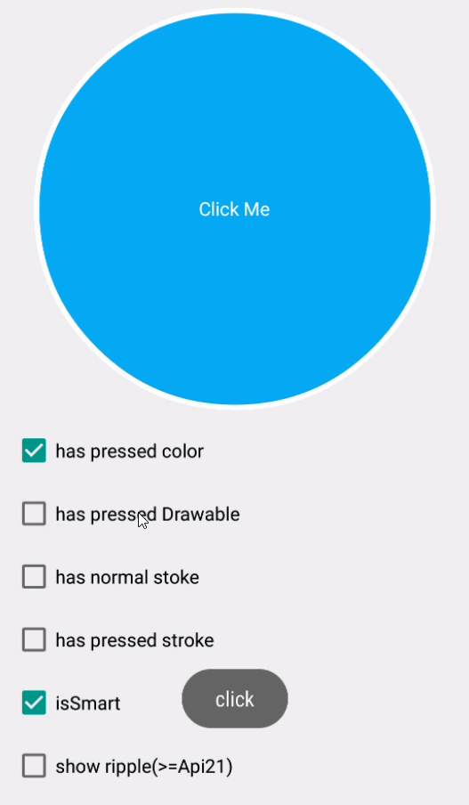

# SelectorInjection    
[](https://jitpack.io/#tianzhijiexian/SelectorInjection)


一个强大的selector注入器。它可以给view注入selector状态，免去了你写selector的步骤。  
如果你的需求很简单，不妨试试这篇文章讲到的一张图片实现selector的方法：[http://www.cnblogs.com/tianzhijiexian/p/4505190.html](http://www.cnblogs.com/tianzhijiexian/p/4505190.html)

--  

###前言   
之前特别讨厌写selector，所以最近想要干掉它，借鉴了[https://github.com/hanks-zyh/SelectorButton](https://github.com/hanks-zyh/SelectorButton)和[https://github.com/navasmdc/MaterialDesignLibrary](https://github.com/navasmdc/MaterialDesignLibrary)两个开源库的写法，最终融汇贯通，产生了能将颜色和形状两两组合的selector注入器。  
现在这个注入器支持且**不仅仅**支持下列的按钮，你可以通过layer-list和shape的组合产生更多的按钮。  


###效果   


###引入方式  
1.添加JitPack仓库

```  
repositories {
	maven {
		url "https://jitpack.io"
	}
}
```   

2.添加依赖  
> compile 'com.github.tianzhijiexian:SelectorInjection:[Latest release](https://github.com/tianzhijiexian/SelectorInjection/releases)'

###支持的属性   
https://github.com/tianzhijiexian/SelectorInjection/blob/master/injection/src/main/res/values/attrs.xml   

```xml
<declare-styleable name="SelectorInjection">
    <!-- 普通状态的颜色 -->
    <attr name="normalColor" format="color" />
    <!-- 按下后的颜色 -->
    <attr name="pressedColor" format="color" />
    <!-- 选中后的颜色 -->
    <attr name="checkedColor" format="color" />

    <!-- 常规状态下 (drawable)-->
    <attr name="normalDrawable" format="reference" />
    <!-- 按下/获得焦点 (drawable) -->
    <attr name="pressedDrawable" format="reference" />
    <!-- 选中时 (drawable)-->
    <attr name="checkedDrawable" format="reference" />

    <!-- 正常的描边 -->
    <attr name="normalStrokeColor" format="color" />
    <attr name="normalStrokeWidth" format="dimension" />
    <!-- 按下后的描边 -->
    <attr name="pressedStrokeColor" format="color" />
    <attr name="pressedStrokeWidth" format="dimension" />
    <!-- 选中后的描边 -->
    <attr name="checkedStrokeColor" format="color" />
    <attr name="checkedStrokeWidth" format="dimension" />

    <!-- 是否是自动计算按下颜色的的，默认true -->
    <attr name="isSmart" format="boolean" />

    <!-- 是否将图片设置到src中 (ImageButton独有属性) -->
    <attr name="isSrc" format="boolean" />

    <!-- 是否显示水波纹（Android5.0以上有效）-->
    <attr name="showRipple" format="boolean" />
</declare-styleable>
```  

###使用方式
我们可以根据需要将其注入到任何一个view中去，本项目中将其注入到了ImageButton、TextView、Button中，你可以参考它们的实现来做自己的自定义view。

在xml中使用：  
```xml   
<kale.ui.view.SelectorTextView
  android:layout_width="300dp"
  android:layout_height="300dp"
  android:text="Click Me"
  android:textColor="@android:color/white"

  app:normalColor="#03a9f4"
  app:normalDrawable="@drawable/btn_oval_shape"
  app:normalStrokeColor="#ffffff"
  app:normalStrokeWidth="4dp"
  />
```   

###还有更多  
你以为它仅仅是干掉了selector么？当然不是，它还对shape有着巨牛逼的支持。我们定义一个shape，然后传入一个normalColor，它会自动将normalColor填充到shape的背景中并自动产生按下后的效果。  

而在shape中我们可以做的事情就多了，比如添加个边框、加个虚线什么的。但shape仅仅能画的是简单且扁平化的形状，能不能让它支持阴影什么的呢？当然可以，SelectorInjection还支持了layer-list。你可以将阴影的框架和shape进行叠加，这样就能产生很多其他的效果了。  
需要注意的是，如果你要用layer-list，你需要给要填充的item定一个固定id，即`@android:id/background`，它会自动去找到这个id下的shape进行颜色的填充。  

```xml
<?xml version="1.0" encoding="utf-8"?>
<layer-list xmlns:android="http://schemas.android.com/apk/res/android" >
    <!-- other item -->
    <item android:drawable="@drawable/btn_oval_shadow_mask"/>
    <!-- target item -->
    <item
        android:id="@android:id/background"
        >
        <shape android:shape="oval" >
            <solid android:color="@android:color/transparent" />
        </shape>
    </item>

</layer-list>
```

具体的做法和更加详细的api见demo。

### 开发者


Jack Tony: <developer_kale@foxmail.com>  

### License

    Copyright 2016 Jack Tony

    Licensed under the Apache License, Version 2.0 (the "License");
    you may not use this file except in compliance with the License.
    You may obtain a copy of the License at

       http://www.apache.org/licenses/LICENSE-2.0

    Unless required by applicable law or agreed to in writing, software
    distributed under the License is distributed on an "AS IS" BASIS,
    WITHOUT WARRANTIES OR CONDITIONS OF ANY KIND, either express or implied.
    See the License for the specific language governing permissions and
    limitations under the License.
